# sick_visionary_gev_ros2 <!-- omit from toc -->

**Overview**

This repository contains a ROS2 driver for Visionary-T Mini AP (V3S145-1AAAAAA), Visionary-S AP (V3S142-1AAxxxx) and Visionary-B Two (V3S146-1AXXXXX). It is written in C++ and designed to work with ROS2 Humble/Iron/Jazzy.
> Note: The ROS2 publisher requires the [Visionary GigE Vision Basic App](https://apppool.cloud.sick.com/publications/2db9b93b-134c-42e5-8925-2a0374d9715c) to run on the device.


**License**

The source code is released under [The Unlicense](./LICENSE)

## Table of contents <!-- omit from toc -->

- [Supported Environments](#supported-environments)
- [Supported SICK Cameras](#supported-sick-cameras)
- [Getting started](#getting-started)
  - [Prerequisite - Camera setup](#prerequisite---camera-setup)
    - [Visionary GigE Vision Basic App](#visionary-gige-vision-basic-app)
    - [IP configuration (for each camera)](#ip-configuration-for-each-camera)
    - [Connecting Multiple Cameras](#connecting-multiple-cameras)
  - [Prerequisite - ROS installation](#prerequisite---ros-installation)
  - [Dependencies](#dependencies)
    - [Ubuntu](#ubuntu)
- [Installation - SICK Visionary ROS2 wrapper](#installation---sick-visionary-ros2-wrapper)
  - [Ubuntu 24.04](#ubuntu-2404)
- [Architecture](#architecture)
  - [Nodes](#nodes)
    - [VisionaryPublisher-Node (Mandatory)](#visionarypublisher-node-mandatory)
    - [PointcloudPublisher-Node (Optional)](#pointcloudpublisher-node-optional)
  - [Topics](#topics)
  - [Parameters](#parameters)
    - [1. Camera settings (GigE Vision Camera Parameters)](#1-camera-settings-gige-vision-camera-parameters)
    - [2. Node settings (Node parameters)](#2-node-settings-node-parameters)
    - [The parameter yaml file](#the-parameter-yaml-file)
    - [Get and set parameters at runtime](#get-and-set-parameters-at-runtime)
- [Run](#run)
  - [A. Manual Composition (Compile time composition)](#a-manual-composition-compile-time-composition)
  - [B. Composition using Launch Files](#b-composition-using-launch-files)
- [Understanding the transforms (frames/coordinate systems)](#understanding-the-transforms-framescoordinate-systems)
- [FAQ](#faq)
  - [1. Time synchronization (Setting the device system time)](#1-time-synchronization-setting-the-device-system-time)

## Supported Environments

The ROS2 wrapper in this repository have been tested with the following platforms:

| **Platform**             |**ROS 2**      | **Compiler**                | **Version**        |
| ------------------------ |---------------|-----------------------------| ------------------ |
| Ubuntu 22.04             | Humble & Iron |gcc                          | 11.4.0             |
| Ubuntu 24.04             | Jazzy         |gcc                          | 13.2.0             |


## Supported SICK Cameras

| **Device Name**                      | **Part No.**     | **Description**                      | **Firmware Version** | **GigE App**|
| -------------------------------------| -----------------| ------------------------------------ | -------------------- |-------------|
| Visionary-T Mini AP (V3S145-1AAAAAA) | 1132065          | 3D time-of-flight camera             | 3.15.3                 |2.0.1        |
| Visionary-B Two (V3S146-1AAAAAA)     | 1133032          | 3D stereovision camera with RGB data | 3.18.0                 |   2.0.1          |
| Visionary-S AP (V3S142-1AAxxxx)      | 1114320, 1114319 | 3D structured light stereovision camera with RGB data | 3.15.0 |    2.0.1         |

## Getting started

### Prerequisite - Camera setup

#### Visionary GigE Vision Basic App

The ROS2 wrapper provided here is based on the GigE Vision protocol. To be able to use the ROS2 wrapper, the `Visionary GigE Vision Basic App` must be installed on the used cameras. With the app, the cameras stream according to the GigE Vision protocol. The app can be downloaded via the [SICK AppPool](https://apppool.cloud.sick.com/publications/2db9b93b-134c-42e5-8925-2a0374d9715c). For information on the installtion of the app please refer to the user manual and the documentation on the product page which can be accessed via the **SICK Product ID: pid.sick.com/{P/N}/{S/N}**.

**{P/N}** corresponds to the part number of the product (see type label).  
**{S/N}** corresponds to the serial number of the product (see type label).

#### IP configuration (for each camera)

> Note: The following steps are for Ubuntu OS.

**1. Connect your camera:**
Ensure that your camera is connected to a network interface using an Ethernet cable.
In this example we connect our Visionary device via an ethernet cable to eth0.

> **Note**: With the installation of the _Visionary GigE Vision Basic_ app, the factory default IP configuration is DHCP. If no DHCP server is found, the
devices assign a Link Local Address (LLA) in the format 169.254.x.y by default.

We recommend to **change the device IP** to your preferred subnet. For this please refer to the user manual of your device as decribed in [the previous chapter](#visionary-gige-vision-basic-app). 

**2. Configure the Network Interfaces IP Address**

The camera IP address and your network interface need to be on the same subnet.

**2.1. Check the Current Network Configuration**
Check the current network configuration using:

```bash 
ip a
```
You might get the following output:
```bash 
eth0: <BROADCAST,MULTICAST,UP,LOWER_UP> mtu 1500 qdisc pfifo_fast state UP group default qlen 1000
link/ether XX:XX:XX:XX:XX:XX brd ff:ff:ff:ff:ff:ff
inet 192.168.1.10/24 brd 192.168.1.255 scope global noprefixroute eth0
```
The interface must have a different IP address than the camera. Otherwise the discovery will fail. You need to change the IP address of the network interface or the default IP address of the camera.

**2.2 Changing the Network Interface IP Address**

If your network interface is on a different subnet, you need to configure it to match the camera’s subnet. For example, if your network interface is on a different subnet or has the same ip address as the camera you can change it like this. The example assumes a camera IP address of 192.168.1.10:

```bash 
sudo ip addr add 192.168.1.100/24 dev eth0
sudo ip link set dev eth0 up
```
Verify the change:
```bash 
ip addr show eth0
```

**3. Set MTU to 9000**

In order to receive jumbo frames, you need to adjust your interface to handle a MTU of 9000. 
Change `YOURINTERFACE` with your actually used interface, for example `eth0`.

```bash
sudo ip link set dev YOURINTERFACE mtu 9000
```

#### Connecting Multiple Cameras
There are two ways to connect multiple cameras:

1. Different Network Interfaces: Use different network interfaces with different subnets, ensuring each camera has a unique IP address within these subnets.

2. Using a Network Switch: Connect a switch to a network interface with a given IP address. Ensure the cameras are connected to the switch and have distinct IP addresses within the switch’s subnet.

For each camera you have to follow the above steps as mentioned in [IP configuration](#ip-configuration-for-each-camera).

> **Note**: Please take the data transmission rates of the individual cameras into account when using multiple cameras. All supported cameras require a Gigbit-Ethernet.
 
### Prerequisite - ROS installation

It is necessary to have a working ROS2 environment set up. If you do not have ROS2 installed, please refer to the official ROS2 documentation for installation instructions.

We recommend you to follow the installation guides for your operating system:

- **Ubuntu 22.04**: Install the full ROS2 Iron package `ros-iron-desktop` on Ubuntu 22.04 from [Debian packages](https://docs.ros.org/en/iron/Installation/Ubuntu-Install-Debs.html).
- **Ubuntu 24.04**: Install the full ROS2 Jazzy package `ros-jazzy-desktop` on Ubuntu 24.04 from [Debian packages](https://docs.ros.org/en/jazzy/Installation/Ubuntu-Install-Debs.html).

### Dependencies

After installing ROS2 some additional packages/programs are needed.

#### Ubuntu

For Ubunutu only ´xacro´ must be installed. It's used for loading the camera model files (.urdf and .xacro) for visualisation in Rviz2. The following example assumes a ROS2 Jazzy installion.

```bash
sudo apt update
sudo apt install ros-jazzy-xacro
```

## Installation - SICK Visionary ROS2 wrapper

### Ubuntu 24.04

> Note: for Ubuntu 22.04 replace adjust the ROS2 version to `iron`.

**1. Clone the Repository:**
```bash
git clone https://github.com/SICKAG/sick_visionary_gev_ros2.git
cd sick-ros-wrapper
```

**2. Source the ROS2 Environment:**
Make sure your ROS2 environment is sourced
```bash
# Replace ".bash" with your shell if you're not using bash
# Possible values are: setup.bash, setup.sh, setup.zsh
source /opt/ros/jazzy/setup.bash
```
> **Tip:** To avoid having to run this command every time you open a new terminal, you can add it to your .bashrc file. This way, it will be sourced automatically. 
>```bash
>echo "source /opt/ros/jazzy/setup.bash" >> ~/.bashrc
>```


**3. Edit the Cameras Configuration File**

Before building and running the package you need to edit the cameras [configuration file](./sick_publisher/config/params.yaml):
1. Fill the `serial`-array with the serial numbers of your cameras (**mandatory**)
2. Adjust the camera parameters to your needs (optional)

See [The parameter yaml file](#the-parameter-yaml-file) chapter for more details.


**5. Build the Package:**
Navigate to the root of your workspace and build the project using _colcon_
```bash
colcon build \
  --event-handlers console_cohesion+ \
  --packages-select sick_publisher \
  --cmake-args -DCMAKE_EXPORT_COMPILE_COMMANDS=ON
```

**6. Source Your Local Workspace:**
```bash
source install/local_setup.bash
```

## Architecture

```mermaid
flowchart LR

/visionary_camera/cam_123456[ /visionary_camera/cam_123456 ]:::main
/visionary_camera/pointcloud_publisher_123456[ /visionary_camera/pointcloud_publisher_123456 ]:::main
/visionary_camera/cam_123456/robot_state_publisher[ /visionary_camera/cam_123456/robot_state_publisher ]:::main
/visionary_camera/pointcloud_publisher_123456[ /visionary_camera/pointcloud_publisher_123456 ]:::node
/visionary_camera/cam_123456/camera_info([ /visionary_camera/cam_123456/camera_info<br>sensor_msgs/msg/CameraInfo ]):::topic
/visionary_camera/cam_123456/depth([ /visionary_camera/cam_123456/depth<br>sensor_msgs/msg/Image ]):::topic
/visionary_camera/cam_123456/diagnostics([ /visionary_camera/cam_123456/diagnostics<br>diagnostic_msgs/msg/DiagnosticStatus ]):::bugged
/visionary_camera/cam_123456/imu([ /visionary_camera/cam_123456/imu<br>sensor_msgs/msg/Imu ]):::bugged
/visionary_camera/cam_123456/rgb([ /visionary_camera/cam_123456/rgb<br>sensor_msgs/msg/Image ]):::topic
/visionary_camera/cam_123456/pointcloud([ /visionary_camera/cam_123456/pointcloud<br>sensor_msgs/msg/PointCloud2 ]):::bugged
/visionary_camera/cam_123456/joint_states([ /visionary_camera/cam_123456/joint_states<br>sensor_msgs/msg/JointState ]):::bugged
/visionary_camera/cam_123456/robot_description([ /visionary_camera/cam_123456/robot_description<br>std_msgs/msg/String ]):::bugged
/visionary_camera/cam_123456/get_type_description[/ /visionary_camera/cam_123456/get_type_description<br>type_description_interfaces/srv/GetTypeDescription \]:::bugged
/visionary_camera/pointcloud_publisher_123456/get_type_description[/ /visionary_camera/pointcloud_publisher_123456/get_type_description<br>type_description_interfaces/srv/GetTypeDescription \]:::bugged
/visionary_camera/cam_123456/robot_state_publisher/get_type_description[/ /visionary_camera/cam_123456/robot_state_publisher/get_type_description<br>type_description_interfaces/srv/GetTypeDescription \]:::bugged

/visionary_camera/cam_123456/camera_info --> /visionary_camera/pointcloud_publisher_123456
/visionary_camera/cam_123456/depth --> /visionary_camera/pointcloud_publisher_123456
/visionary_camera/cam_123456/rgb --> /visionary_camera/pointcloud_publisher_123456
/visionary_camera/cam_123456/joint_states --> /visionary_camera/cam_123456/robot_state_publisher
/visionary_camera/cam_123456 --> /visionary_camera/cam_123456/camera_info
/visionary_camera/cam_123456 --> /visionary_camera/cam_123456/depth
/visionary_camera/cam_123456 --> /visionary_camera/cam_123456/diagnostics
/visionary_camera/cam_123456 --> /visionary_camera/cam_123456/imu
/visionary_camera/cam_123456 --> /visionary_camera/cam_123456/rgb
/visionary_camera/pointcloud_publisher_123456 --> /visionary_camera/cam_123456/pointcloud
/visionary_camera/cam_123456/robot_state_publisher --> /visionary_camera/cam_123456/robot_description
/visionary_camera/cam_123456/get_type_description o-.-o /visionary_camera/cam_123456
/visionary_camera/pointcloud_publisher_123456/get_type_description o-.-o /visionary_camera/pointcloud_publisher_123456
/visionary_camera/cam_123456/robot_state_publisher/get_type_description o-.-o /visionary_camera/cam_123456/robot_state_publisher

subgraph keys[<b>Keys<b/>]
subgraph nodes[<b><b/>]
topicb((Not connected)):::bugged
main_node[main]:::main
end
subgraph connection[<b><b/>]
node1[node1]:::node
node2[node2]:::node
node1 o-.-o|to server| service[/Service<br>service/Type\]:::service
service <-.->|to client| node2
node1 -->|publish| topic([Topic<br>topic/Type]):::topic
topic -->|subscribe| node2
node1 o==o|to server| action{{/Action<br>action/Type/}}:::action
action <==>|to client| node2
end
end
classDef node opacity:0.9,fill:#4A9BCF,stroke:#3183B4,stroke-width:4px,color:#fff
classDef action opacity:0.9,fill:#93E3FF,stroke:#3183B4,stroke-width:2px,color:#fff
classDef service opacity:0.9,fill:#7ACBF5,stroke:#62B3EA,stroke-width:2px,color:#fff
classDef topic opacity:0.9,fill:#62B3EA,stroke:#A3D4F7,stroke-width:2px,color:#fff
classDef main opacity:0.9,fill:#3183B4,stroke:#3183B4,stroke-width:4px,color:#fff
classDef bugged opacity:0.9,fill:#A3D4F7,stroke:#3183B4,stroke-width:2px,color:#fff
style keys opacity:0.15,fill:#FFF
style nodes opacity:0.15,fill:#FFF
style connection opacity:0.15,fill:#FFF

```



### Nodes

**Before running the nodes it's important you understand the general architecture of the ROS2 wrapper**

The package contains two different composable nodes:
1. VisionaryPublisher-Node
2. PointcloudPublisher-Node

#### VisionaryPublisher-Node (Mandatory)

The `VisionaryPublisher-Node` (named _/visionary_camera/cam_123456_ in the above graph) connects to the camera via the GenIStream library (a SICK internal wrapper of the GenICam/GenTL producer API). It connects to the right camera by matching the found serial numbers in the network with the serial number specified in the [Parameter file](#the-parameter-yaml-file). It then sets the user defined settings like Framerate, Autoexposure etc. which it reads from the above mentioned parameter file. Only after successful establishing a connection and setting of the parameters it starts the camera stream. Once the stream starts the node converts the received frames to RGB/grayscale and depth data and publishes them subsequently.

#### PointcloudPublisher-Node (Optional)

Starting the `PointcloudPublisher-Node` (named _/visionary_camera/pointcloud_publisher_123456_ in the above graph) is optional. The node subscribes to the following topics published by the `VisionaryPublisher-Node`:
1. /rgb or /grayscale
2. /depth
3. /camera_info 

It creates a pointcloud from the received information and publishes to the `/pointcloud` topic.

### Topics

The VisionaryPublisher- and Pointcloudpublisher-Nodes each publish a variety of different topics. Each node publishes these topics under its own namespace. The used naming convention is `node_namespace/node_name/topic_name`, where node_namespace is the camera model and the node_name is "cam_" + serialnumber. For example `/visionary_b_two/cam_123456/rgb`

The table below shows an overview of these topics. 

| **Topic Name**           | **Message type**                     | **Description/Use case**       |**Published by Node**|
| ------------------------ | -------------------------------------| -------------------------------|---------------------|
| /tf                      | tf2_msgs/msg/TFMessage               | Not actively used              | RobotStatePublisher |           
| /tf_static               | tf2_msgs/msg/TFMessage               | Rviz2 Visualisation, Coordinate system transforms    | VisionaryPublisher & RobotStatePublisher|
| /camera_info             | sensor_msgs/msg/CameraInfo           | Contains internal camera parameters for pointcloud creation | VisionaryPublisher|
| /depth                   | sensor_msgs/msg/Image                | 16 bit 1 channel depth image   | VisionaryPublisher  |
| /diagnostics             | diagnostic_msgs/msg/DiagnosticStatus |                                | VisionaryPublisher  |
| /joint_states            | sensor_msgs/msg/JointState           | Not actively used              | RobotStatePublisher |
| /pointcloud              | sensor_msgs/msg/PointCloud2          |                                | PointcloudPublisher |
| /rgb or /grayscale       | sensor_msgs/msg/Image                | 8 Bits 3 channel rgb or 16 bit grayscale | VisionaryPublisher|
| /robot_description       | std_msgs/msg/String                  | Rviz2 camera model visualisation| RobotStatePublisher |

### Parameters

The ROS2 wrapper uses two types of parameters. The first type consists of camera settings (GigE Vision specific parameters), which are configured directly on the device via the SICK-specific GigE Vision API _sick_visionary_gev_base_. The second type comprises node specific parameters, which manage the publishing of topics and services such as RGB or depth.

#### 1. Camera settings (GigE Vision Camera Parameters)

GigE Vision parameters are utilized to configure the camera device itself. Inside the constructor the [VisionaryPublisher-Node](#visionarypublisher-node-mandatory) reads these parameters from the [params.yaml](#the-parameter-file) (see also [here](#the-parameter-yaml-file)) and configures the camera, after it has established a connection.
These parameters are set using the SICK-specific GigE Vision API and include settings such as:

- **Components**: 
  1. "Range"
  2. "Intensity"
  3. "ImuBasic"
- **Exposure Time**: Controls the duration for which the camera sensor is exposed to light (stereovision cameras only).
- **Frame Rate**: Specifies the number of frames captured per second.
- **Scan3dDataFilterSelector**: Used to select different filters.
- and more...

These parameters are essential for optimizing the camera's performance for specific applications and environments.

>Note: Changing of camera settings during runtime is currently not supported.

#### 2. Node settings (Node parameters)

The node specific parameters control the behavior of the ROS2 nodes, including the publishing of topics and services such as RGB or depth. These parameters can be dynamically reconfigured. 

The following ROS2 parameters can be used to interact with the ROS nodes:

**Visionary-Publisher Node:**
| **Parameter Name**       | **Type**                    | **Default Value**  | **Description**                                         |
| ------------------------ | --------------------------- | ------------------ | ------------------------------------------------------- |
| serial_number            | string                      | ""                 | Serial number of the device (Should be set before runtime)|
| set_streaming            | bool                        | true               | Start/stop the frame stream from the camera             |
| publish_intensity        | bool                        | true               | Activate/deactivate publishing of intensity-topic (Camera stream may still be running)|
| publish_depth            | bool                        | true               | Activate/deactivate publishing of depth-topic (Camera stream may still be running)|

**Pointcloud-Publisher Node:**
| **Parameter Name**       | **Type**                    | **Default Value**  | **Description**                                         |
| ------------------------ | --------------------------- | ------------------ | ------------------------------------------------------- |
| serial_number            | string                      | ""                 | Serial number of the device (Should be set before runtime)|
| publish_pointcloud       | bool                        | true               | Activate/deactivate publishing of pointcloud-topic (RGB and depth topics may still be subscribed to)|

#### The parameter yaml file

The parameters are configured in [params.yaml](sick_publisher/config/params.yaml) which is located under `sick_publisher/config/params.yaml` or `install/sick_visionary_gev_ros2/share/sick_publisher/params.yaml`

A minimal parameter file is made of two sections:

1. The **serial_numbers section** lists all devices (serial numbers) that are active in the current system for which you want to spawn VisionaryPublisher- and PointcloudPublisher-Nodes. The serial numbers must be listed according to their respective camera types. \
This section gets parsed inside the [Manual Composition Executable](sick_publisher/src/ManualComposition.cpp) and the [Launch Composition Script](sick_publisher/launch/sick_publisher_launch.py), which then spawn a VisionaryPublisher-Node (and a PointcloudPublisher Node) for each serial number.  

2. The **visionary_b_two/visionary_s/visionary_t_mini section** which specify the node and camera settings. For each camera type there is a `general` and a `device specific` section. \
The general section specifies parameters and settings which will be set for every device of this camera type. If the same parameter has a different value in the `device-specific` (**cam_+serialnumber)** section, the value from the specific section will be used, effectively overwriting the general section value.

Below you see an exemplary params.yaml file.
>Note: Our default [params.yaml file](sick_publisher/config/params.yaml) shows a more complex example. 

It specifies the following system settings:
-  3 devices of type visionary_b_two with serial numbers: 22222, 55555, 77777
-  All devices are streaming
-  All VisionaryPublisher-Nodes are publishing to the intensity topic  
-  All VisionaryPublisher-Nodes except the one of cam_77777 are publishing to the depth topic
-  cam_77777 has default translation and rotation values. cam_22222 and cam_77777 have specific values that overwrite the default values
-  cam_22222 and cam_77777 stream Range and Intensity data. cam_55555 additionally streams ImuBasic data
-  All devices disabled ExposureAuto for the Range component
-  cam_22222 enabled the ValidationFilter with Level -3
-  All devices act as PTP slaves syncing their system time to the best PTP master in the network

```yaml
serial_numbers:
  visionary_b_two: ["22222", "55555", "77777"]

visionary_b_two:
  general:
    set_streaming: true
    publish_intensity: true
    publish_depth: true
    camera_rotation: [0., 0., 0.]
    camera_translation: [0., 0., 0.]
    gev_config:
      ComponentList: ["Range", "Intensity"]
    gev_params:
      PtpEnable: true # sets the device as PTP slave
      ExposureTimeSelector: "Range"
      ExposureAuto: "Off" # Off / Continuous
  cam_22222:
    camera_rotation: [0.2, 0.2, 0.2]
    camera_translation: [1.0, 2.0, 3.0]
    gev_params:
      Scan3dDataFilterSelector: "ValidationFilter"
      Scan3dDataFilterEnable: 1
      Scan3dDepthValidationFilterLevel: -3
  cam_55555:
    camera_rotation: [0.5, 0.5, 0.5]
    camera_translation: [4.0, 5.0, 6.0]
  gev_config:
      ComponentList: ["Range", "Intensity", "ImuBasic"]
  cam_77777:
    publish_depth: false
```

#### Get and set parameters at runtime

All specified parameters i.e. [node params](#2-node-settings-node-parameters) and [camera params](#1-camera-settings-gige-vision-camera-parameters) can be read during runtime.  
Use the following commands to get the parameters:
```bash
ros2 param get NAMESPACE/NODENAME PARAMETER_NAME
# For example
ros2 param get /visionary_b_two/cam_123456 publish_rgb

```

For now only [Node params](#2-node-settings-node-parameters) can be set during runtime. 
Use the following commands to set the parameters:
```bash
ros2 param set NAMESPACE/NODENAME PARAMETER_NAME VALUE
# For example
ros2 param set /visionary_b_two/cam_123456 publish_rgb false
```

## Run

### A. Manual Composition (Compile time composition)
The shared libraries can be reused to compile a single executable running multiple components without using ROS interfaces.

**manual_composition** is an executable which has one or multiple composable nodes hardcoded in its main function. Those are typically VisionaryPublisher-Nodes such as `/visionary_b_two/cam_123456` for example, which connect to a camera and publish:
- RGB Images
- Depth Images
- Pointcloud

> **Warning**: Manually-composed components **will not be reflected in the `ros2 component list`** command line tool output.

To run the publisher node, use the following command:
```bash
ros2 run sick_visionary_gev_ros2 manual_composition
# or
ros2 run sick_visionary_gev_ros2 manual_composition --publish_pointcloud=false
# get help
ros2 run sick_visionary_gev_ros2 manual_composition --help
```

### B. Composition using Launch Files

Composing nodes into a single process usually contains two steps: 
1. Start a container node
2. Load the nodes into the container node through launch actions

This can be done via command line tools. While the command line tools are useful for debugging and diagnosing component configurations, it is often more convenient to start a set of components at the same time. To automate this action we can use the [main launch file](sick_publisher/launch/sick_publisher_launch.py), which launches multiple VisionaryPublisher-Nodes depending on the serial numbers specified in the [config file](sick_publisher/config/params.yaml). By default the same amount of PointcloudPublisher-Nodes will be launched. To prevent the launching of these nodes add the launch argument `publish_pointcloud:=False`.

```bash
ros2 launch sick_visionary_gev_ros2 sick_publisher_launch.py
#or 
ros2 launch sick_visionary_gev_ros2 sick_publisher_launch.py publish_pointcloud:=False
# show args
ros2 launch sick_visionary_gev_ros2 sick_publisher_launch.py --show-args
```

> **Note**: Components composed at runtime **will be reflected in the `ros2 component list`** command line tool output.

## Understanding the transforms (frames/coordinate systems)

There are three primary coordinate systems:

1. **World or Map** Coordinate System: This serves as the root coordinate system, within which all subsequent coordinate systems are defined.
2. **Camera_Link** Coordinate System: Also referred to as the reference coordinate system in the GigE Vision naming convention, this is a right-handed coordinate system with its origin at the center of the front of the camera housing. The z-axis extends outward from the camera. The point cloud and depth map are provided in this coordinate system.`
3. **Anchor** Coordinate System: This system has its origin at the camera's focal point, with the z-axis aligned along the optical axis of the camera.

## FAQ

### 1. Time synchronization (Setting the device system time)
**Q**: How can I set my device time to the current time?  
My device shows as a default the frame time (= 2020-01-06 01:20:43.104078 UTC):
```
header:
  stamp:
    sec: 1578273643
    nanosec: 1578273643.104078000
```
**A:** You can achieve an accurate device system time (=frame time) by syncing your device via the Precision Time Protocol (PTP) to a master clock on your network. This can be achieved with the following steps:

1.  Make sure your camera is connected to a host PC which runs a **PTP service as master**.
For example to run the standard linux **ptpd** service: 
`sudo ptpd -M -i YOUR_INTERFACE -V`

2.  Enable **PTP Slave** mode on your device from the config file by adding a parameter like this: 
```
gev_params:
  PtpEnable: true
```
3. Launch the ros2 Nodes. The device time will sync almost instantly to the master clock.
